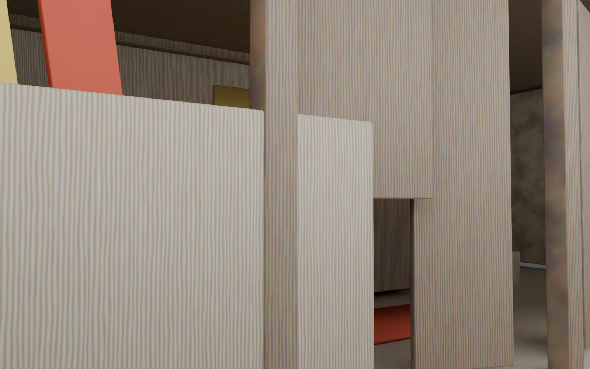

<div align="center">

# KARMA

### A Thai psychological horror experience on Roblox

_เมื่อทุกอย่างไม่ได้เป็นอย่างที่เห็น การตามหาความจริงอาจปลุกบางสิ่งที่ควรถูกฝังไว้_

</div>


> **KARMA** อยู่ระหว่างการพัฒนา เนื้อหา ระบบ และภาพที่แสดงใน repository นี้อาจเปลี่ยนแปลงได้

## เนื้อเรื่อง

คุณก้าวเข้าสู่คฤหาสน์เพื่อค้นหาคำตอบ โถงทางเข้าดูเหมือนถูกทิ้งร้าง แต่บันทึกลับจากวันที่ "ทุกอย่างเปลี่ยนไป" เตือนเอาไว้ว่า สิ่งที่เห็นอาจไม่ใช่ความจริง

ยิ่งสำรวจลึกเข้าไป ร่องรอยต่าง ๆ ยิ่งนำคุณไปหา **Jada** และห้องพิธีกรรมที่ไม่มีใครอธิบายถึงจุดประสงค์ของมันได้ เกิดอะไรขึ้นในสถานที่แห่งนี้ และเหตุใดทุกเบาะแสจึงดูเหมือนถูกทิ้งไว้เพื่อรอคุณโดยเฉพาะ?

## รูปแบบการเล่น

- สำรวจคฤหาสน์และสภาพแวดล้อมเพื่อหาทางไปต่อ
- โต้ตอบกับวัตถุ เก็บไอเท็ม และจัดการช่องเก็บของแบบตาราง
- ค้นหาและอ่านบันทึกเพื่อประกอบเรื่องราวที่กระจัดกระจาย
- เปิดสมุดบันทึกในโทรศัพท์เพื่อย้อนดูเบาะแสที่ค้นพบ
- ใช้ไฟฉายซึ่งส่องตามทิศทางกล้องเพื่อสำรวจพื้นที่มืด
- ทำภารกิจ ตั้งแต่วิธีเข้าสู่คฤหาสน์ไปจนถึงการนำของสำคัญกลับสู่ห้องพิธีกรรม
- วิ่งหนีหรือเร่งสำรวจด้วยระบบ Sprint และ Stamina

## ระบบที่พัฒนาแล้ว

- ระบบ Objective และ Quest ที่ทำงานร่วมกับ Trigger, การเก็บไอเท็ม และจุดวางไอเท็ม
- ระบบ Inventory ขนาด 5x5 พร้อมการหมุน ย้าย ถือ และวางไอเท็ม
- ระบบ Interaction แบบ Proximity Prompt พร้อมการตรวจสอบระยะทางฝั่งเซิร์ฟเวอร์
- ระบบ Note Reader และ Journal สำหรับเก็บบันทึกที่ผู้เล่นอ่านแล้ว
- โทรศัพท์ในเกม พร้อมหน้าสมุดบันทึกและแผนที่
- ระบบไฟฉายติดมือที่ปรับลำแสงตามมุมกล้อง
- ระบบ Sprint, Stamina, เสียง และเอฟเฟกต์กล้อง
- ระบบ Localization ภาษาไทย อังกฤษ จีนตัวย่อ สเปน โปรตุเกส ฝรั่งเศส เยอรมัน รัสเซีย เกาหลี และอินโดนีเซีย
- หน้าคำเตือนและระบบโหลดทรัพยากรก่อนเริ่มเล่น

## การควบคุม

| ปุ่ม | การทำงาน |
| --- | --- |
| `E` | โต้ตอบ / อ่านบันทึก |
| `Left Shift` | วิ่ง |
| `I` | เปิดหรือปิด Inventory |
| `1` | ใช้ช่องไอเท็มด่วน |
| `R` | หมุนไอเท็มใน Inventory |
| `Tab` | สลับระหว่างลายมือและข้อความของบันทึก |
| `Q` / `Esc` | ปิดหน้าบันทึก |

## ทดลองต้นแบบ

Repository นี้มีไฟล์ Roblox Studio สำหรับตรวจสอบต้นแบบ:

1. เปิด `tmp/Roblox-validation.rbxlx` ด้วย Roblox Studio
2. กด **Play** เพื่อทดสอบระบบภายใน Place
3. เปิดหน้าต่าง **Output** หากต้องการตรวจข้อความเริ่มต้นระบบหรือคำเตือน

ไฟล์ `tmp/phone-controller-build.rbxlx` เป็น build สำหรับตรวจระบบโทรศัพท์โดยเฉพาะ ส่วนซอร์ส Luau ที่แยกเป็นโมดูลอยู่ใน `tmp/Roblox/src`

## โครงสร้างโปรเจกต์

```text
.
├── blender/
│   └── thai_spirit_house.py     # สร้างโมเดลศาลไทยด้วย Blender
├── output/
│   ├── exports/                 # ไฟล์ .blend และ .glb
│   └── renders/                 # ภาพเรนเดอร์สำหรับอ้างอิง
└── tmp/
    ├── Roblox-validation.rbxlx  # Place สำหรับตรวจสอบต้นแบบ
    ├── phone-controller-build.rbxlx
    └── Roblox/src/
        ├── client/              # UI, โทรศัพท์, ไฟฉาย, Sprint และ Inventory
        ├── server/              # Interaction, Quest และ Inventory services
        └── shared/              # Config, ข้อมูลเนื้อเรื่อง และ Localization
```

## งานภาพและสภาพแวดล้อม

โมเดลศาลไทยใน repository สร้างแบบ procedural ด้วย Blender และส่งออกเป็น `.blend` กับ `.glb` เพื่อใช้เป็นแนวทางสำหรับสภาพแวดล้อมและฉากพิธีกรรม



## คำเตือนเนื้อหา

เกมมีบรรยากาศกดดัน แสงกะพริบ และเสียงดังฉับพลัน แนะนำให้สวมหูฟังเพื่อรับประสบการณ์เต็มรูปแบบ และโปรดใช้วิจารณญาณในการเล่น

